<h3 align="center">Certified nonsense profile readme</h3>

### Activities

<!--START_SECTION:activity-->
1. 🔒 Closed issue [#6626](https://github.com/nix-community/home-manager/issues/6626) in [nix-community/home-manager](https://github.com/nix-community/home-manager)
2. 🔒 Closed issue [#29](https://github.com/matadaniel/LazyVim-module/issues/29) in [matadaniel/LazyVim-module](https://github.com/matadaniel/LazyVim-module)
3. 💪 Opened PR [#371](https://github.com/SylvanFranklin/.config/pull/371) in [SylvanFranklin/.config](https://github.com/SylvanFranklin/.config)
4. 🔒 Closed issue [#9](https://github.com/apptesters-org/AppTesters_Repo/issues/9) in [apptesters-org/AppTesters_Repo](https://github.com/apptesters-org/AppTesters_Repo)
5. ❗ Opened issue [#9](https://github.com/apptesters-org/AppTesters_Repo/issues/9) in [apptesters-org/AppTesters_Repo](https://github.com/apptesters-org/AppTesters_Repo)
<!--END_SECTION:activity-->

### Stats

  
  

If you enjoy what I do please 🌟 Star my repos, 💕 Follow me [@phucisstupid](https://github.com/phucisstupid). Your support means a lot! 🥰
